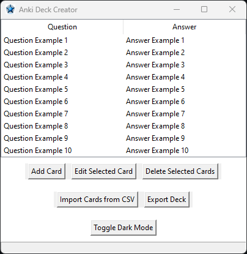

# Anki Deck Master

Anki Deck Master is a desktop application that allows users to quickly create Anki flashcard decks for studying and memorization. With an intuitive GUI made with tkinter, users can easily add, edit, and delete cards.

The final result is a `.apkg` file that can be imported into Anki.

The purpose of this project was to make the library Genanki more accessible to people that are not able to code, or do not want to bother.



## Features

- Add, edit, and delete flashcards
- Import flashcards from a CSV file
- Visualize and manage your cards in an intuitive tree view
- Export decks in the `.apkg` format compatible with Anki
- Dark mode (that is a bit broken right now) for comfortable use in different lighting conditions

## Installation Guide

To install and run Anki Deck Master, you have two options, either you [download and run the .exe](https://github.com/PuddingNight/Anki-Deck-Master/releases/download/Anki_Deck_Master/Anki_Deck_Master.exe) that is made available for you, or you can clone this repo and run it like a normal script.

- For the first option, you will get a warning from chrome and / or Windows defender. if you do not want to run the risk of executing code that you did not audited, choose the second option after you've read the deck_creator.py.
- For the second option, please follow these guidelines:

### Prerequisites

- Python 3.6 or higher
- pip

### Setup

1. Clone the repository:
   ```sh
   git clone https://github.com/PuddingNight/Anki-Deck-Master
   ```

2. Navigate to the cloned repository:
    ```sh
    cd Anki-Deck-Master
    ```

3. Install the dependencies in a virtual environnement:
    ```sh
    pip install -r requirements.txt
    ```

## Running the Application

After the installation of the dependencies, you can run the application using:
    ```sh
    python deck_creator.py
    ```

If you chose to use the `.exe` file, just double click on it.

# Known Issues

- Dark mode has some visual inconsistencies and might not work perfectly on all systems.
- The CSV import work with the ";" separator.
- Only a Windows executable (if you really need it for your plateform, i can port it, just open a ticket.)

# License

This project is licensed under the MIT License. Do whatever you want with this code.

Thanks to the great people behind Genaki for making this possible !